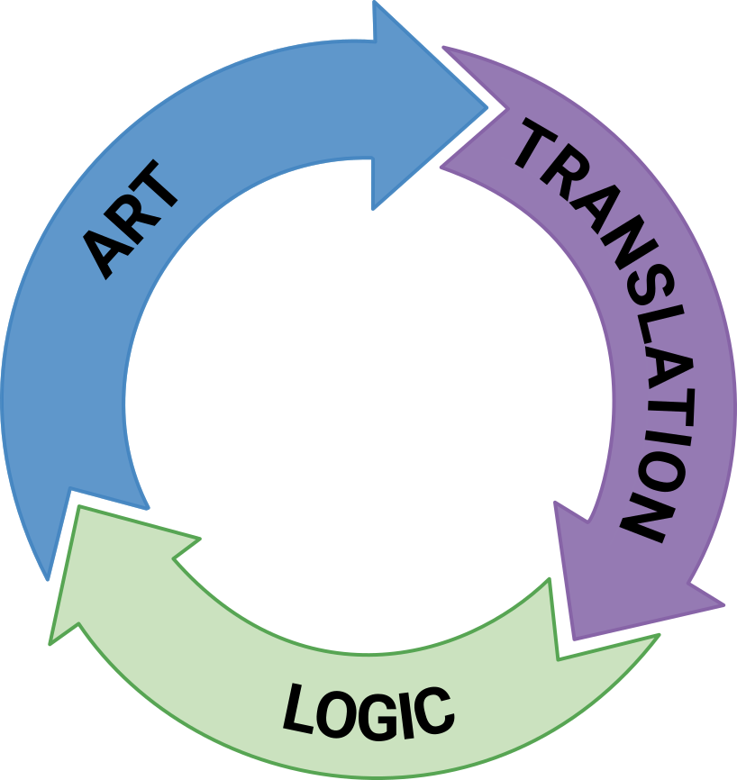

# Dan's SVG Tools Console Application


## 🆕 Introducing Implied Form Design

The notion of implied form design involves giving you the ability to draw normal art in your favorite vector editor then to convert it directly to a working application GUI with very little effort, effectively separating the roles of artist from front-end developer, simultaneously giving each of those roles drastically increased focus on their own unique tasks, and retaining the original art as the maintainable center of visual truth during the evolution cycle.

Rather than spending weeks and months on declarative, code based approaches like those dictated by XML and XAML, without any decent visual editor, and where the smallest creative change decision can set you back by hours or even days, you can now spend most of your design time in the visual SVG editor\* easily producing reliable, flexible art as normal SVG files that, once saved, are piped directly into to the development team's application project and related compiler.

The basic goal of Implied Form Design is that if you can at least indicate what you want on your form, then SvgTools can give you that actual, working GUI form that compiles successfully into a desktop application. There shouldn't be any other requirements other than when you feel like becoming more specific about various details. In other words, you imply what you want, and when the conversion runs, it infers a working form from your indications.

<p>&nbsp;</p>

### Problems Solved by Implied Form Design

Among others, the Implied Form Design approach can solve the following problems.

<p>&nbsp;</p>

#### The Code-First Method Problem

Over the past two decades, the software industry has drifted steadily, and now almost unavoidably, into what can only be described as a **code-first** approach to user interface creation. In practice, though, code-first is a gentle euphemism. A more honest and accurate description is that today's frameworks enforce a **code-only** tactic for UI design. The canonical form of any user interface is now invariably some variant of XML, XAML, JSX, HTML/CSS, or another declarative syntax. Visual composition is no longer something you design, it's something you author as text.

Even the most advanced UI frameworks reveal this bias. Many provide a preview window, but those previews often serve only as thin veneers over the underlying markup. They lag behind, render inconsistently, or fail outright unless the code is fully valid and correctly structured. Only a handful of frameworks make any meaningful attempt to offer visual-first editing tools, and among those, even fewer allow designers to actually begin with a blank visual canvas, which is the natural starting point for any creative visual medium. In nearly all of today's systems, the visual editor is treated not as the primary workspace but as an optional, secondary convenience. Possibly something you consult at the end to verify that the wall of code produced the form you imagined.

And even in the rare tools that do permit direct visual editing, creators remain trapped within the same conceptual constraints that plague the broader ecosystem. Because the underlying representation is still declarative and hierarchical, every visual manipulation must map back to rigid containment structures. These tools haven't been able to escape the gravitational pull of XML's worldview. Therefore, even when you manipulate elements visually, you are still bound by the **Structure Before Expression Problem** described below, and forced to think in terms of nested containers and parent-child pipelines rather than pure spatial and relational design intent.

The result is a design workflow that is fundamentally inverted. Instead of expressing visual ideas and then refining them into structure, practitioners are required to author structure and hope it eventually reconstructs the intended visual expression. This inversion doesn't just inconvenience designers, but it disqualifies them, too. It replaces the act of composition with the act of coding, and in doing so, it places aesthetic design out of reach for those who are not trained as software engineers, while simultaneously placing it under the tight control of those who are often hopelessly bad at visual expression.

In short, modern GUI development frameworks have not merely deprioritized visual design, they have subordinated it to the requirements of code. By insisting on code-first (and now, most-often, code-only) workflows, they have entrenched a model in which the interface must be thought of as a data structure before it can be thought of as a design. In doing so, they have alienated the very people whose skill and intuition are essential for creating compelling, human-centered interfaces.

<p>&nbsp;</p>

#### The Excluded Artist Problem

A second structural flaw in contemporary GUI development, one that is both cultural and technical, is what can be described as the Excluded Artist Problem. This problem arises from the way modern software workflows systematically sever the creative loop between the visual designer and the final user interface. In large teams especially, the process has calcified into a one-directional pipeline where artists create visual assets, and front-end engineers manually translate those assets into functioning UI code. What once might have been a collaborative iteration has become a terminal hand-off between departments.

Historically, interface artists work in tools that support visual thinking, like illustration suites, layout tools, and high-fidelity prototyping platforms. These environments allow designers to craft rich, expressive, intentional compositions that reflect their understanding of aesthetics, hierarchy, and human perception. However, once these compositions are exported as mockups or screenshots, the designer's influence effectively ends. The work is then delivered to developers who must manually interpret, approximate, and reconstruct the design within the severe constraints of code-first, structure-first UI frameworks.

Critically, this hand-off is not a collaboration, but an in-depth conversion process, and almost always a lossy one. The richness of the designer's intent is flattened into static images, and the developer is left guessing at the nuances, like spacing intentions, responsive behavior, interaction subtleties, animation timing, layering decisions, and the implicit logic of the composition. In many teams, the artist is completely excluded from what happens next. There is no round-trip, no integrated editing loop, and no mechanism for the artist to refine, correct, or evolve the design once implementation begins.

This exclusion isn't accidental. It is a systemic consequence of the technologies involved. Because modern GUI frameworks require nested structures, XML definitions, and code-based layouts, they dictate that only those fluent in these languages are permitted to shape the final interface. Visual creators, or those most attuned to aesthetics, spatial reasoning, and the emotional resonance of design, are locked out of the implementation phase entirely. They cannot adjust spacing without modifying markup. They cannot alter layout relationships without restructuring containers. They cannot refine interactions without touching JavaScript, C#, or some platform-specific logic.

As a result, the artist's role in UI creation becomes paradoxically marginal. Although they are responsible for the vision, they are completely excluded from the medium that brings the vision to life.

The impact is severe. Without a feedback loop, the design can't evolve. Without collaborative iteration, the final UI often diverges, sometimes subtly, sometimes dramatically, from the original artistic intent. And without tools that allow artists to remain active participants throughout the process, interfaces lose the refinement, nuance, and experiential quality that only visual experts can provide.

In essence, the Excluded Artist Problem describes the growing disconnection between visual design and UI implementation, a gulf widened by code-first workflows, hierarchical declarative languages, and tools that grant creative authority only to those who can program in code. Until GUI systems allow visual thinkers to participate directly in crafting the final product, the artist will remain an outsider in a domain that should be inseparable from their craft.

<p>&nbsp;</p>

#### The Structure Before Expression Problem

Even in the cases where some visual editing capabilities for GUI design have been produced and made available to the public, they fail the artist horribly when it comes to the fundamental limitation in today's GUI application design stems from what can be called the **Structure Before Expression Problem**. This problem arises most visibly in XML-, XAML-, and other declarative-layout frameworks, where visual design must be articulated through hierarchical containment structures before any expressive, creative, or compositional decisions can be made.

Declarative layout languages achieve their capabilities primarily through nested containment, where every visible element must live inside a container, which itself lives inside another container, and so on. While this approach has technical coherence, is easy to compile, and at the very highest level, may feel passably aligned with how we think of a "page" containing its elements, it profoundly fails to map cleanly onto how human designers conceptualize visual composition.

Even at that top level, the containment metaphor is already strained. Human designers don't mentally begin by placing everything inside of a box called "page". Instead, they think spatially, compositionally, and relationally. Objects exist in a 2D, or other conceptual space, not because they are children of a node, but because they have position, relationship, intention, and visual meaning. In practice, elements frequently violate or transcend boundaries; bleeding, overlapping, floating, or existing in conceptual space outside the so-called "frame", and all of which, all declarative hierarchies struggle to represent.

However, the real breakdown occurs as the required structure becomes deeper and more rigid. Modern interfaces often contain multiple layers of grids, stacks, panels, and alignment containers. In XML/XAML paradigms, which constitute the basis for almost all contemporary GUI development platforms, this means every alteration, no matter how visually small, must be expressed through structural rearrangement of nested nodes. The designer's creative expression becomes constrained not by visual intent but by the strictures of a hierarchical syntax.

As a result, instead of ever asking, how a form should appear to the user, the designer is required to constantly think about where an object must be placed in the tree.

The direct consequence is that the tools expected to enable visual creativity are constantly imposing a cognitive tax that is tangent to the act of design itself. Designers must reason about parent-child relationships, element hosting, layout logic, and structural validity long before they can express ideas visually. At this point, all work in this field no longer resembles graphic or interaction design, but data modeling.

It's therefore unsurprising that few artists or visually oriented designers are willing, or even able, to work within these systems. The prerequisite mindset is fundamentally at odds with their own process. A paradigm that forces creators to build structure-first and expression-second inevitably alienates those whose creative flow depends on immediate visual iteration rather than pre-validated hierarchical constructs.

In short, the dominance of containment-driven declarative languages has created an environment where expressive GUI design is downstream of structural correctness. This inversion of priorities not only impedes rapid visual exploration but also discourages the very practitioners most qualified to elevate GUI aesthetics. Until GUI technologies allow expression to lead structure, rather than the reverse, many designers have simply opted out.

<p>&nbsp;</p>

### Application Development Improvements from Implied Form Design

In stark contrast to the current state of code-first declarative GUI design, and without having to make any changes to the underlying infrastructure, following the Implied Form Design approach allows a modern software application development team of any size to experience separation of duties between the artist and the code development team, while remaining synchronized and iterative in respect to project goals, aesthetic quality, and binary output, as well as participating in a creation and production process that is literally several times faster for the entire team on nearly every occasion.

Following are some of the benefits afforded by the Implied Form Design process.

#### Expression Before Structure

UI is allowed to begin with freeform expression. Artists are able to place elements intuitively, as though they were painting on a canvas, without needing to define containers, hierarchies, or layout rules upfront. In other words, the artist is allowed complete freedom to let the design emerge organically, where structure follows creativity rather than preceding it.

This approach also maintains consideration for the artist's permanent participation throughout the evolution of the application, so that any visual changes needing to be made for the next version of application can be initiated directly by the artist, without requiring that individual to make any changes to the file, in it's interpreted state, before getting started.

####  Visual-First, Code-Second

The primary interface for UI creation is visual, tactile, and itself visually interactive. Code is strictly an after-the-fact, behind-the-scenes handling of visual intent, in most cases created automatically, and not ever the starting point.

Visual designers are never forced to learn a markup language to express visual ideas, especially one like XAML, or many other declarative alternatives that follow the same core principles, that have virtually no indexing, modular segregation, or consistency in construction or inter-brand definition. That type of markup language is a complete mess of unorganized characters and inconsistent patterns, and should almost always be considered to be a type of hands-off style structure that can be extremely useful in automation, though not at all helpful for creation or maintenance, let alone casual reading, by humans.

#### Fluid Grouping and Rearrangement

Because of being hosted in a visual-specific editing environment like Inkscape, elements are freely movable, groupable, and reconfigurable at any stage of the design process. Grouping is allowed to be a post-expression act, which reflects the natural evolution of the layout, helps to label important assemblies, and helps to quickly align objects on the screen using common alignment tools, depending upon the artist's instantaneous intent. Grouping is also retractable, meaning that anything that has been grouped can be ungrouped with zero or minimal consequences.

Put another way, with the Implied Form Design process, user interface design tools support dynamic visual restructuring without any penalty or complexity.

If, in the next version of the user interface, the artist moves several items from one layer or group to another to better represent the visual aspect of the idea, the destruction or loss of previous interpreted objects will not be detrimental to the product, and the individual in the interpretation role can easily re-classify objects that are either new or newly unclassified, without backward harm to the visual art.

#### Real-Time Feedback

Because of using an existing tool created specifically for artists, designers are able to see immediate visual results of their actions without having to initiate any compile steps or abstract, complicated previews. Just as with painting on a canvas the artist is able to interact with instant, accurate rendering of the work as it evolves.

The canvas is alive, interactive, and reflective of every creative decision, which is both expected and delivered in the wide variety of vector editors available today.

#### Semantic Flexibility

Naming, identification, and binding are completely optional at the artwork stage. If the artist elects to place that information, it can be done with minimal distraction, and literally zero intrusion on the art itself. The system doesn't demand any rigid declarations while the art is in progress. Phrased in a different way, the function of the file adapts to, and accepts, the artist's form.

#### Design as Dialogue

Tools are pure collaborators instead of gatekeepers. In the Implied Form Design process, user interface creation feels much more like a conversation between the artist and the tool than a demanding specification that must be met before anything works at all.

#### Accessibility of Tools

In the Implied Form Design process, creativity is never gated by technical knowledge. To assure this result, the barrier to entry is low or even non-existent. Artists are able to download easy-to-use, free, open-source software, and create interfaces without needing to understand ANY programming paradigms, layout engines, or dependency properties.

Artists understand what makes a view or visual tool intuitive to another person, and they don't ever need to be involved in how that is going to be achieved in computer logic, which is a different, possibly incompatible, skill.

#### Evolution Over One-Time Perfection

UI design isn't a destination but a journey, so implied designs are allowed to evolve continuously. This approach natively supports iterative refinement, versioning, and experimentation without punishing the designer for changing their mind; once or a hundred times.

<p>&nbsp;</p>

### The Roles of Implied Form Design

Implied Form Design is an iterative process that involves the following specialized roles.

-   **Graphic artist**. A visual artist, not required to know anything at all about any form of coding, including layout formats like XAML or XML, which are only two of the most horrible, cryptic, inconsistent codes ever invented, having very few human-readable artifacts other than to the well-trained eye, and offer even less source maintainability or reusability.
-   **Translator**. Often a person in an IT-style role, who requires very little artistic or development skill, but is able to organize and manage files and identities. In teams of two, the application developer is able to cover the translation steps as a separate task.
-   **Application developer**. The developer of the functional target application.

<center></center>

### Single Role GUI Application Development

If you are running a one-person shop, your entire job can suddenly become immensely faster, more productive, and vastly easier. Using this approach, it is once again feasible for an individual to create an entire multi-form XAML application in less than one day, similarly to the productive output that was once possible in the prior widget-based form era.

<p>&nbsp;</p>

### The Steps of Implied Form Design

Whether you look at it only through the eyes of the artist or through those of the entire team, the overall process is easy, too.

-   **Draw**. Use freeform drawing techniques to draw the shapes, text, and images of the form.
-   **Label**. If the person in the artist's role is aware of the control and surface names for the project, they can associate that information using simple labels and target IDs. Otherwise, that information can non-destructively be added to the drawing file by the translator or the application developer.
-   **Done**. Run the conversion and deliver the finished form to the development team.

\* - Note: Inkscape is the only tested SVG editor at this time. Other editors will be supported as their unique output characteristics are identified.

<p>&nbsp;</p>

### Current Limitations of Implied Form Design

As mentioned above, I have only been using Inkscape to this point to test this functionality. As I identify the idiosyncrasies of the output from other SVG editors, however, I will gradually be adding support for those as well.

This version only supports output to Avalonia XAML, a cross-platform .NET GUI platform that compiles directly to Linux, Mac, and Windows. However, as this version becomes stabilized, it can easily be reconfigured to support all other known XAML, XML, and HTML/CSS variants that constitute modern UI layout foundations.

<p>&nbsp;</p>

### More Information

If you plan to use the SvgTools impled form design processes, please feel free to read the user manual on this website at \[Docs/ImpliedFormDesign-UserManual.pdf\](https://danielanywhere.github.io/SvgTools/ImpliedFormDesign-UserManual.pdf)

The general README for SvgTools follows.

---

### 

<p>&nbsp;</p>

## Background

This application was created to perform commonly-needed tasks related to SVG files, like those exported from Inkscape, Adobe Illustrator, Canva, Figma, or others.

The function library will offer a very long list of features in the near future, many of which have already been written, but still need to be integrated into this version. Please stay tuned for what I hope will be a continuing stream of improvements.

<p>&nbsp;</p>

## Current Toolset

The application currently supports the following actions.

-   **ApplyTransforms**. This action dereferences all linked objects in the document, applies transforms to every object in the hierarchy, and removes all of the transforms.<p>&nbsp;</p>
-   **Batch**. Load a batch file, whose actions are defined in JSON format, to run multiple actions. See the files **Docs/CommandLines.md** and **Scripts/SvgToolsBuildWizardForms.json** for a practical example.<p>&nbsp;</p>
-   **CalculateTransform**. Display the result of an SVG transform like matrix, scale, rotate, etc., applied to caller-supplied x, y, width and height variables. This action has no effect on the file.<p>&nbsp;</p>
-   **CleanupSvg**. This action dereferences all linked objects, applies transforms, purges unreferenced items from the defs section, and rounds all values to the specified decimal precision (default precision = 3 if not specified).<p>&nbsp;</p>
-   **DereferenceLinks**. This action serves the purpose of encapsulating as many of the referenced shapes from the defs section as possible into the actual implementation targets from where they have been referenced. This allows each object to be handled freely and independently, either in a visual or text editor.<p>&nbsp;</p>
-   **ImpliedDesignEnumerateControls**. Enumerate the controls found in the provided implied form design.<p>&nbsp;</p>
-   **ImpliedDesignToAvaloniaXaml**. Convert the specified implied form design SVG file to Avalonia XAML.<p>&nbsp;</p>
-   **OpenWorkingSvg**. Only supported in batch mode, this action opens an SVG file so multiple actions can be taken during the same session.<p>&nbsp;</p>
-   **PurgeDefs**. This action removes unreferenced elements from the defs section.<p>&nbsp;</p>
-   **RoundAllValues**. This action rounds all values to the specified precision, according to number of decimal places, and including whole ones and tens places if the precision is 0 or negative, respectively.<p>&nbsp;</p>
-   **SaveWorkingSvg**. Only supported in batch mode, this action saves the changes to the current working SVG in memory.<p>&nbsp;</p>
-   **SortSymbols**. This action alphabetically sorts the symbols list in the defs section of the SVG.<p>&nbsp;</p>
-   **XamlManifest**. Output a manifest of the objects, and optionally their properties, of a XAML file. Console output by default, with text file output optional.<p>&nbsp;</p>
-   **XamlMergeContents**. Merge the contents of two or more XAML files, producing a single output file. Helpful in cases where multiple SVG drawings will be used as a series of panels on a target form.<p>&nbsp;</p>

<p>&nbsp;</p>

## Version Notes

This version is currently available as command-line application only, but work is proceeding that will expose this functionality for programmatic use in other applications.

Please read the <b>Docs/Syntax.txt</b> file for more information. You can also get some sample ideas from <b>Docs/CommandLines.md</b> and <b>Docs/WorkingSvg-SvgTools01.json</b>.

On any system with .NET Core installed, you can get the project and run it initially using the following commands.

```batch
git clone https://github.com/danielanywhere/SvgTools
cd SvgTools/Source/SvgTools
dotnet run -- /? /wait

```

(This ReadMe file was created in LibreOffice Write!)
